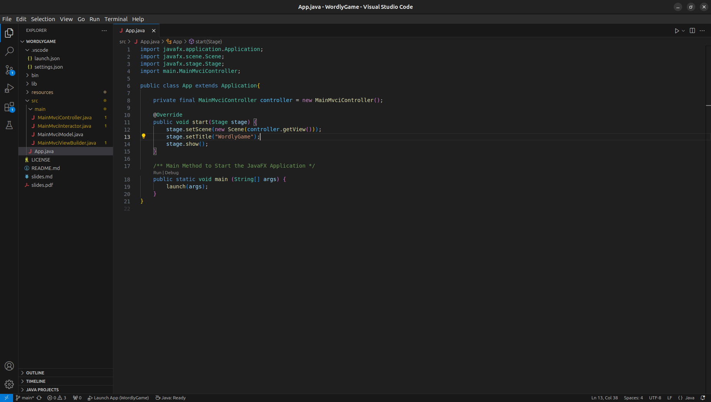
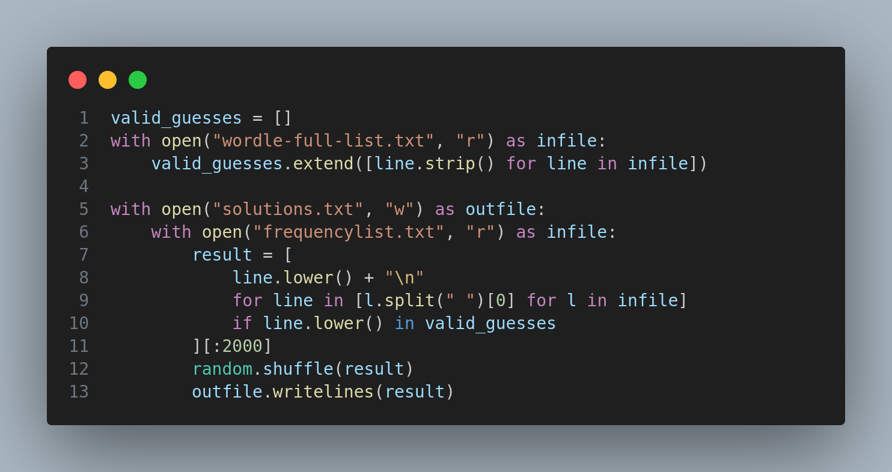
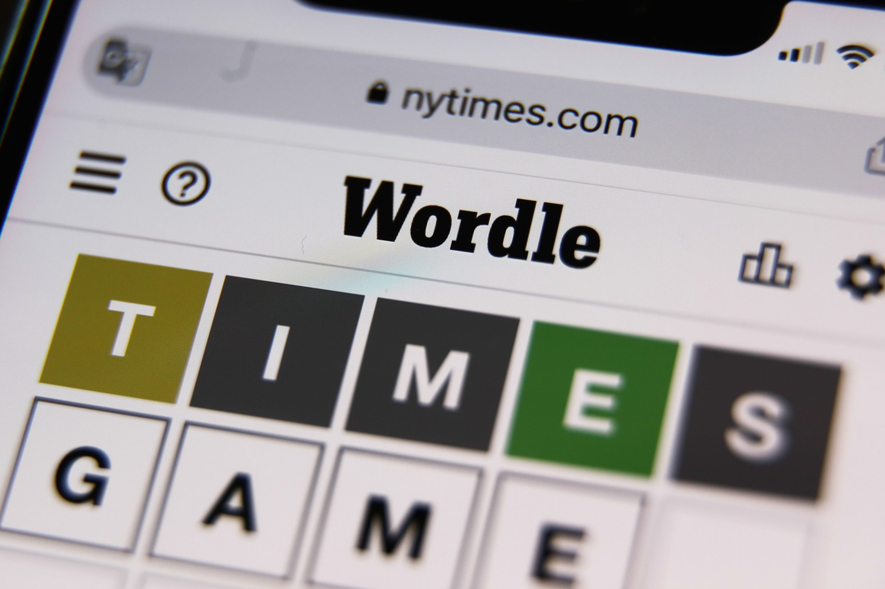

---
title:
- Wordly Game - Project Update
author:
- Renn Gilbert
theme:
- Frankfurt
institute:
- "CSC1061: Computer Science II"
date:
- March 28, 2024
---

# Requirements

1. The project shall only allow the user to guess 5 letter words.
2. The project shall allow the user to enter 6 guesses.
3. The project shall compare users' guesses to the correct word, giving them feedback using colors.
4. The project shall read a list of words from **a** list of upcoming words. [^1]
5. The project shall store user data and statistics in a file.
6. The project should validate users' guesses by comparing them with a dictionary file.
7. The project should allow the user to continue playing after the day's word is complete.
8. The project will use the Model-View-Controller-Interactor architecture.
   * [Article on PragmaticCoding](https://www.pragmaticcoding.ca/javafx/mvci/)
9. The project will use AtlantaFX for GUI controls.

[^1]: this requirement was changed

## Requirement Change

Requirement #4 was changed.

4. The project shall read a list of words from **Wordle's** list of upcoming words.

$$\downarrow$$

4. The project shall read a list of words from **a** list of upcoming words.

### Why?

After the New York Times bought Wordle, they switched the word lists many times. Now, they are curating a word each day.

# Class Diagrams


# Flow Diagrams

## GUI Flow Diagram


## File Flow Diagram


## Data Flow Diagram


# Project Setup

## GitHub Repository


## Bare-bones setup



# Research

## Compiling Word Lists

For my research, I decided to compile my list of words and solutions.

### dictionary.txt

To compile `dictionary.txt`, a list of valid words, I manually scraped the data from the official Wordle valid word list. [Link](https://www.nytimes.com/games-assets/v2/9658.3bcb7e7ddeaadc9414c7.js). The resulting list is over 14,000 words long.

### solutions.txt

To compile `solutions.txt`, a sequential list of upcoming solutions, I used [FrequencyWords](https://github.com/hermitdave/FrequencyWords/tree/master), a GitHub repository with words sorted by their frequency in a corpus (in various languages). I filtered it for words that are in `dictionary.txt`, limited it to the 2,000 most common, and shuffled it.

## Script



## Sample Data

::: columns

:::: column

### dictionary.txt

```
aahed
aalii
aapas
aargh
aarti
abaca
abaci
abacs
abaft
abaht
```

::::

:::: column

### solutions.txt

```
whine
spell
saved
parts
drank
sites
ducky
fatty
steak
stock
```

::::

:::

# The End

