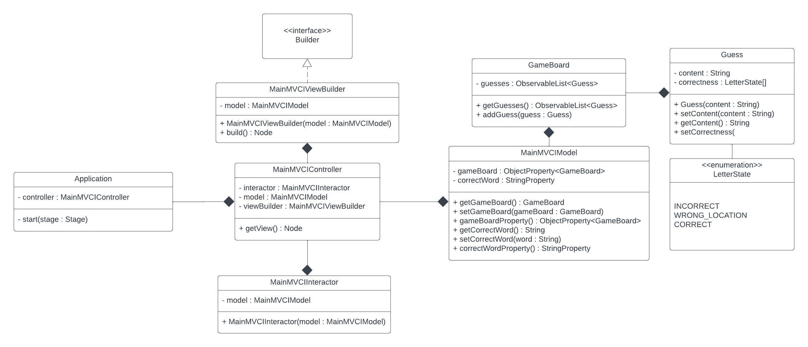
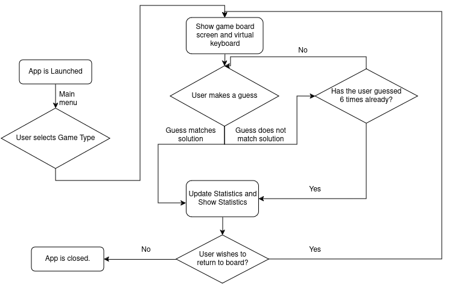
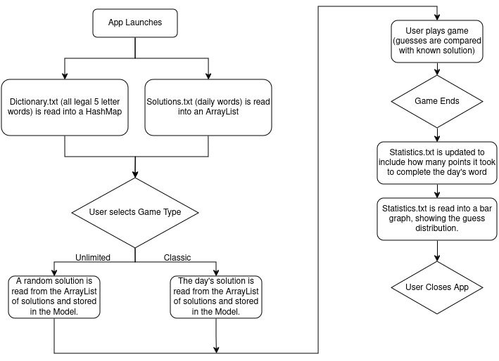
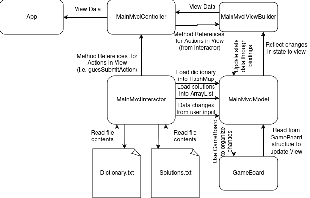
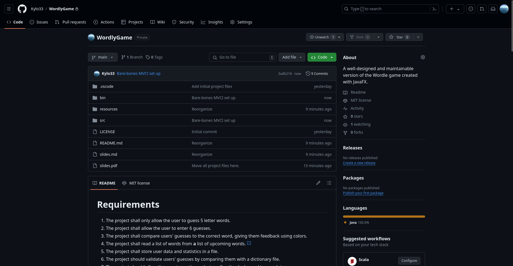

---
title:
- Project Update
author:
- Renn Gilbert
theme:
- Frankfurt
institute:
- "CSC1061: Computer Science II"
date:
- March 28, 2024
---

# Requirements

1. The project shall only allow the user to guess 5 letter words.
2. The project shall allow the user to enter 6 guesses.
3. The project shall compare users' guesses to the correct word, giving them feedback using colors.
4. The project shall read a list of words from **a** list of upcoming words. [^1]
5. The project shall store user data and statistics in a file.
6. The project should validate users' guesses by comparing them with a dictionary file.
7. The project should allow the user to continue playing after the day's word is complete.
8. The project will use the Model-View-Controller-Interactor architecture.
   * [Article on PragmaticCoding](https://www.pragmaticcoding.ca/javafx/mvci/)
9. The project will use AtlantaFX for GUI controls.

[^1]: this requirement was changed

## Requirement Change

Requirement #4 was changed.

4. The project shall read a list of words from **Wordle's** list of upcoming words.

$$\downarrow$$

4. The project shall read a list of words from **a** list of upcoming words.

### Why?

Wordle is constantly changing their list of words. Without any form of API, it is unrealistic to try to keep up with their changes.

# Class Diagrams

# Flow Diagrams

## GUI Flow Diagram

## File Flow Diagram

## Data Flow Diagram

# Project Setup

## GitHub Repository

## Bare-bones setup

# Research

# The End

Thank you.