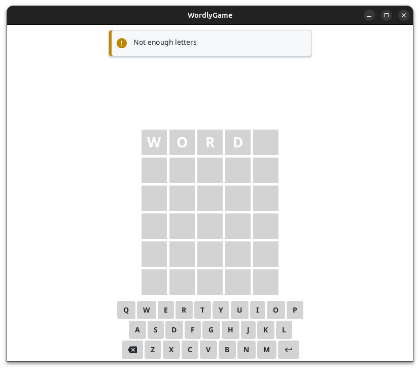

---
title:
- Wordly Game - Project Update
author:
- Renn Gilbert
theme:
- Frankfurt
institute:
- "CSC1061: Computer Science II"
date:
- March 28, 2024
---

# Requirements

- [x] The project shall only allow the user to guess 5 letter words.
- [x] The project shall allow the user to enter 6 guesses.
- [x] The project shall compare users' guesses to the correct word, giving them feedback using colors.
- [x] The project shall read a list of words from **a** list of upcoming words.
- [x] The project shall store user data and statistics in a file.
- [x] The project should validate users' guesses by comparing them with a dictionary file.
- [x] The project should allow the user to continue playing after the day's word is complete.
- [x] The project will use the Model-View-Controller-Interactor architecture.
   * [Article on PragmaticCoding](https://www.pragmaticcoding.ca/javafx/mvci/)
- [x] The project will use AtlantaFX for GUI controls.

# Demo

# Source Code

## Exciting Piece of Code

I made a simple NotificationSystem class as a general way to handle sending notifications:

```java
public class NotificationSystem {
    private final List<Consumer<String>> messageRecievers = new ArrayList<>();

    public void sendMessage(String message) {
        messageRecievers.forEach(c -> c.accept(message));
    }

    public void addMessageReciever(Consumer<String> stringConsumer) {
        messageRecievers.add(stringConsumer);
    }
}
```

## How I Used It

### GameMvciModel.java
```java
private final NotificationSystem notificationSystem = new NotificationSystem();
```

### GameMvciInteractor.java
<!-- ```java
if (currentGuess.getCharacters()
        .stream()
        .anyMatch(c -> c == ' ')) {
  model.getNotificationSystem().sendMessage(
      "Not enough letters");
  return;
}; -->

if (!model.getDictionary().contains(
        guessWord.toLowerCase())) {
  model.getNotificationSystem().sendMessage(
      "Not in word list");
  return;
};
```

## How I Used It

### GameMvciViewBuilder.java

```java
private void addPopups(StackPane result) {
      model.getNotificationSystem().addMessageReciever(message -> {
         Notification notification = new Notification(message, new FontIcon(MaterialDesignA.ALERT_CIRCLE));
         
         // Styles omitted

         result.getChildren().add(notification);
         SequentialTransition seqTransition = new SequentialTransition (
               Animations.fadeIn(notification, Duration.millis(100)),
               new PauseTransition(Duration.millis(1000)), // wait a second
               Animations.fadeOut(notification, Duration.millis(100))
         );
         seqTransition.setOnFinished(f -> result.getChildren().remove(notification));
         seqTransition.playFromStart();
      });
    }
```

## End Result



# The End

